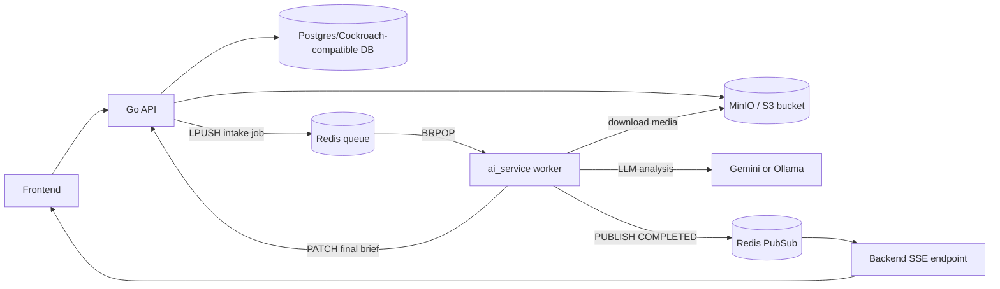

# AI Service Architecture

This document describes the current implementation of `ai_service/` in Briefly.

The `ai_service` is a Python background worker that turns a submitted intake into a structured brief. Although it is packaged as a FastAPI app, it is not a user-facing inference API. Its primary job is to consume Redis queue messages, run a LangGraph pipeline, and send the final result back to the Go backend.

## Responsibilities

- Consume intake jobs from Redis queue `intake:queue`.
- Download uploaded audio and image assets from S3-compatible storage.
- Transcribe audio and inspect images.
- Synthesize a structured project brief from text and extracted media context.
- Send the generated brief back to the backend.
- Publish a completion event so clients listening over SSE can update in real time.

## Code Layout

- `ai_service/main.py`
  Runs the FastAPI app, creates the Redis polling task on startup, and exposes `/health`.
- `ai_service/agents/orchestrator.py`
  Defines the `IntakeState`, the LangGraph nodes, the graph edges, and `run_pipeline`.
- `ai_service/providers/__init__.py`
  Selects the active LLM provider from environment configuration.
- `ai_service/providers/gemini_provider.py`
  Implements LangChain access to Gemini with exponential backoff.
- `ai_service/providers/ollama_provider.py`
  Implements LangChain access to a local Ollama instance with retry logic.

## High-Level Topology



## Runtime Model

At runtime the service behaves like a single background worker process:

1. `main.py` creates a FastAPI app and a Redis client.
2. On startup, it spawns `process_queue()` with `asyncio.create_task(...)`.
3. `process_queue()` blocks on `BRPOP intake:queue`.
4. When a job arrives, the payload is deserialized and passed to `run_pipeline(payload)`.
5. The worker waits for that pipeline to finish before reading the next job.

This means one `ai_service` process handles jobs serially. Horizontal scale comes from running multiple worker containers, not from parallel job execution inside one process.

## Input Contract

Jobs are produced by `backend/internal/handlers/intake.go` after the backend:

- accepts the multipart intake request,
- uploads optional media to MinIO/S3,
- stores the intake row in the database,
- pushes a JSON job into Redis.

The queue payload currently contains:

```json
{
  "intake_id": "uuid",
  "type": "TEXT | VOICE | IMAGE | MULTI",
  "audio_url": "object-key-or-empty",
  "image_url": "object-key-or-empty",
  "raw_text": "freeform user text",
  "gemini_api_key": "optional per-user key",
  "enqueued_at": "RFC3339 timestamp"
}
```

Two details matter here:

- `audio_url` and `image_url` are object keys, not pre-signed URLs.
- `gemini_api_key` can override the worker's default Gemini API key for that specific job.

## State Model

The LangGraph state is defined as `IntakeState` in `ai_service/agents/orchestrator.py`.

### Source fields

- `intake_id`
- `type`
- `raw_text`
- `audio_url`
- `image_url`
- `gemini_api_key`

### Derived working fields

- `transcription`
- `ocr_text`
- `unified_context`

### Structured output fields

- `summary`
- `goals`
- `success_criteria`
- `constraints`
- `ambiguities`
- `followup_questions`
- `confidence_score`
- `tone_profile`
- `retry_count`

Not every state field is persisted. In the current implementation, `constraints`, `retry_count`, and the computed `confidence_score` do not survive the full round trip into the final stored brief.

## Pipeline Graph

The graph is compiled once at import time and invoked for each job.

```text
ingest
  -> transcribe_and_vision   if audio_url and image_url
  -> transcribe              if audio_url only
  -> vision                  if image_url only
  -> merge                   if text only

transcribe_and_vision -> merge
transcribe -> merge
vision -> merge
merge -> analyze
analyze -> ambiguity
ambiguity -> tone
tone -> finalize
finalize -> END
```

### Node behavior

#### 1. `ingest`

- Logs the intake ID and selected provider.
- Does not mutate state.

#### 2. `transcribe`

- Runs only when `audio_url` exists.
- Downloads the referenced object from S3-compatible storage into a temp file.
- Sends the file to the Gemini Files API.
- Stores the returned transcript in `state["transcription"]`.

#### 3. `vision`

- Runs only when `image_url` exists.
- Downloads the image from S3-compatible storage into a temp file.
- Sends the file to the Gemini Files API.
- Stores the returned description and extracted text in `state["ocr_text"]`.

#### 4. `transcribe_and_vision`

- Executes `transcribe` and then `vision`.
- This is a convenience node, not a parallel fan-out. The two steps currently run sequentially.

#### 5. `merge`

- Combines:
  - raw user text,
  - media transcription,
  - image description / OCR text.
- Produces a single `unified_context` string that downstream LLM steps consume.

#### 6. `analyze`

- Selects the configured provider via `get_provider(...)`.
- Builds a LangChain prompt asking for:
  - a summary,
  - goals,
  - success criteria,
  - constraints.
- Parses the result as JSON and stores it in the graph state.

#### 7. `ambiguity`

- Reuses the provider abstraction.
- Reviews the summary and goals.
- Produces:
  - `ambiguities`
  - `followup_questions`

#### 8. `tone`

- Currently sets a fixed value:
  - `Professional, action-oriented`
- No model call happens here today.

#### 9. `finalize`

- Builds the outbound payload for the backend.
- Sends `PATCH {API_URL}/api/v1/intake/{intake_id}/confirm`.
- If that succeeds, publishes `COMPLETED` to Redis channel `intake:events:{intake_id}`.

## Provider Architecture

The service has a small provider abstraction for text analysis:

- `AI_PROVIDER=gemini`
  Uses `ChatGoogleGenerativeAI`.
- `AI_PROVIDER=ollama`
  Uses `ChatOllama`.

Both provider classes expose the same interface:

- `get_llm()`
- `invoke_with_backoff(...)`

This abstraction is only used by the `analyze` and `ambiguity` nodes.

Important nuance: media processing is not provider-agnostic today. Audio transcription and image analysis always go through the Gemini Files API via `google.genai`, even if `AI_PROVIDER=ollama`.

## Data Persistence and Events

The worker does not write directly to the database.

Instead, persistence is delegated back to the Go API:

1. `finalize` patches `/api/v1/intake/:id/confirm`.
2. The backend marks the intake as `COMPLETED`.
3. The backend creates a `Brief` row with summary, goals, ambiguities, follow-up questions, tone, and confidence score.
4. The worker publishes `COMPLETED` to Redis PubSub.
5. The backend SSE endpoint streams that event to connected clients.

This keeps the worker focused on AI orchestration while the backend remains the system of record for business data.

## External Dependencies

The worker depends on:

- Redis
  Queue consumption and completion PubSub.
- Go backend API
  Final result persistence.
- MinIO / S3
  Downloading uploaded media files.
- Gemini API
  Media understanding, plus text generation when Gemini is the selected provider.
- Ollama
  Optional local text-generation backend for `analyze` and `ambiguity`.

## Key Environment Variables

- `REDIS_URL`
  Redis connection string used by the queue consumer.
- `API_URL`
  Base URL for the backend confirm endpoint.
- `AI_PROVIDER`
  Selects `gemini` or `ollama`.
- `GOOGLE_API_KEY` or `DEMO_GOOGLE_API_KEY`
  Default Gemini credential when a job does not provide `gemini_api_key`.
- `GEMINI_MODEL`
  Gemini model for LangChain text analysis.
- `OLLAMA_BASE_URL`
  Ollama host.
- `OLLAMA_MODEL`
  Ollama model name.
- `S3_ENDPOINT`
- `S3_ACCESS_KEY`
- `S3_SECRET_KEY`

## Failure Handling

The service favors resilience over strict orchestration guarantees:

- The queue loop is wrapped in a broad `try/except`.
- If job processing raises an exception, the error is logged and the worker sleeps for one second before polling again.
- Individual media-processing errors are converted into placeholder strings in the state instead of aborting the whole pipeline.
- Provider calls include retry logic, but only inside the provider classes.

What it does not currently have:

- no dead-letter queue,
- no explicit retry re-enqueue mechanism,
- no persisted failure status update back to the intake row,
- no per-node progress events.

## Current Implementation Notes

These are the most important architecture-level caveats in the current codebase:

1. The worker is queue-driven, not request-driven.
   `FastAPI` is mainly a lightweight process shell plus `/health`; the backend does not call it for AI work.

2. Processing is serial inside a single worker process.
   Even the `transcribe_and_vision` path is sequential, despite using LangGraph.

3. `constraints` are extracted but not persisted.
   The analysis node computes them, but the final payload sent to the backend omits them.

4. `tone_profile` and `confidence_score` are placeholders.
   Tone is hardcoded, and confidence is sent as a fixed `0.95`.

5. The media bucket name is hardcoded in the worker.
   `node_transcribe` and `node_vision` download from bucket `briefly-intake`, while the backend can be configured with `S3_BUCKET`. In `docker-compose.yml`, the backend is currently set to `briefly-media`, so the uploader and downloader may diverge.

6. Intake status does not move through `PROCESSING`.
   The backend creates jobs with `PENDING`, and the current worker flow only causes a later transition to `COMPLETED`.

7. `AI_PROVIDER` does not fully decouple the stack.
   Switching to Ollama only affects the text-analysis nodes. Media understanding still depends on Gemini.

## Summary

`ai_service` is best understood as an asynchronous AI orchestration worker with four layers:

- a FastAPI runtime shell,
- a Redis queue consumer,
- a LangGraph-based transformation pipeline,
- a provider layer for LLM-backed text analysis.

Its current design cleanly separates heavy AI work from the Go API, but it is still an early-stage worker: the graph is mostly linear, some outputs are placeholders, and a few operational gaps remain around retries, status updates, and storage configuration alignment.
