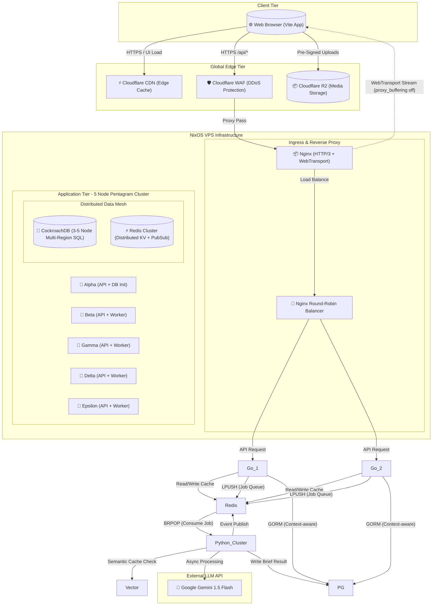
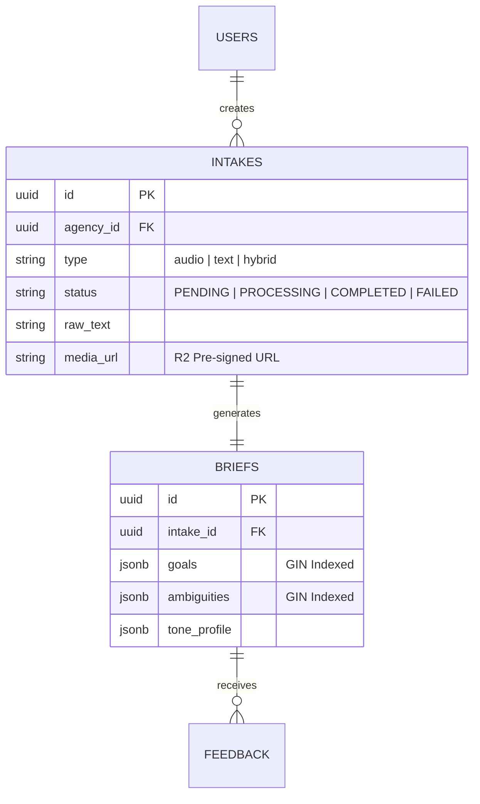
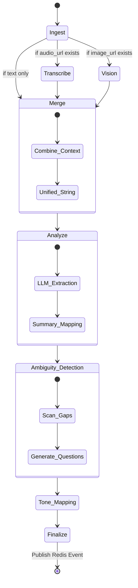
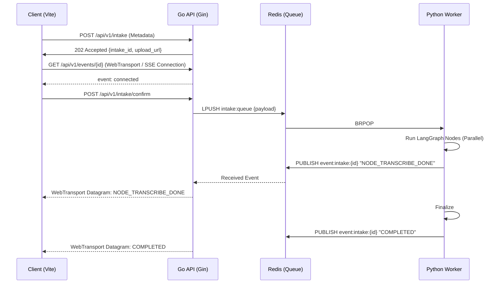

# Project Briefly: Master Architecture Specification

This document serves as the absolute "Source of Truth" and formal contract for the Briefly platform. It defines the operational boundaries, success metrics, visual state roadmap, repository structure, design patterns, and low-level UML diagrams.

---

## 1. Rigorous Capacity Modelling (The Stats)

These figures are derived from our target load of 250 Requests Per Second (RPS) and the constraints of the Oracle Cloud Free Tier.

| Metric | Target Value | Rationale |
| :--- | :--- | :--- |
| **Peak Throughput** | 250 RPS | Supports ~15,000 concurrent active sessions. |
| **P99 API Latency** | < 150ms | Ensures the dashboard feels "instant" during intake creation. |
| **AI Ingestion Latency** | < 5s | Native Multimodal Gemini 1.5 Flash processing. |
| **Max Concurrent Streams** | 5,000 | Limited by Oracle VPS RAM (24GB) and Go Goroutine overhead. |
| **Storage Quota (R2)** | 10GB | Based on 25MB max upload and 7-day retention policy. |
| **Cache Hit Ratio** | > 85% | Read-through caching in Redis for public brief links. |

### Functional Requirements (FR)
- **FR-1: Multi-Modal Ingestion**: Support raw text, .mp3/.wav audio, and .jpg/.png screenshots in a single project intake.
- **FR-2: Agentic Synthesis**: Utilize a 7-node LangGraph pipeline to extract goals, success criteria, and ambiguities.
- **FR-3: Real-Time Status**: Stream pipeline progress to the Agency Dashboard via WebTransport/SSE.
- **FR-4: Living Document**: Generate a shareable, zero-auth URL for clients to view and "Sign Off" on the brief.
- **FR-5: Feedback Loop**: Allow clients to comment on specific extracted goals, triggering a re-generation.

### Non-Functional Requirements (NFR)
- **NFR-1: Scalability**: The Go API must handle 250 RPS on 4 OCPU ARM without horizontal scaling (Vertical efficiency).
- **NFR-2: Availability**: Implement 100% failover to local Llama-3 if external Gemini APIs are disrupted.
- **NFR-3: Security**: Zero-plaintext secret storage via `sops-nix` and Edge-level rate limiting via Cloudflare WAF.
- **NFR-4: Performance**: Optimize the Go runtime with `GOGC=200` to minimize GC pause times under load.
- **NFR-5: Compliance**: Ensure all client data is encrypted at rest in PostgreSQL.

---

## 2. Visual State Roadmap (The Full UX Flow)

These high-fidelity designs define the premium aesthetic for the frontend team across every lifecycle stage.

````carousel

<!-- slide -->

<!-- slide -->

<!-- slide -->

<!-- slide -->

<!-- slide -->

<!-- slide -->

````

---

## 3. Repository Structure & Rationale

The Briefly repository is structured as a **Monorepo**. 

```text
aisprint/
├── ai_service/             # 🧠 The Python AI Worker (LangGraph / FastAPI)
├── backend/                # 🚀 The Go High-Concurrency API (Gin / GORM)
├── frontend/               # 🌐 The Vite User Interface (Tailwind / Zustand)
├── infra/                  # 🏗️ Infrastructure & Deployment (Nginx / sops-nix)
├── cookbooks/              # 📖 Developer Guidelines (Source of Truth)
├── docs/                   # 🗺️ Architectural Blueprints
├── assets/                 # 🎨 Design & Media
├── docker-compose.yml      # 🐳 Local container orchestration
└── flake.nix               # ❄️ NixOS declarative environment setup
```

**Why do we have scaffolding code?**
This scaffolding isn't the final "Business Logic"—it's the **Enforcement Layer**. It enforces boundaries:
*   `infra/nginx/` disables buffering for WebTransport/SSE.
*   `backend/cmd/api/` enforces Graceful Shutdown and `GOGC=200` tuning.
*   `ai_service/agents/` enforces the Fan-Out/Fan-In LangGraph topology.
*   `frontend/src/store/` enforces Zustand over Redux.

---

## 4. Global Topology (HLD & Deployment UML)

This diagram maps the entire platform, explicitly modeling load balancing, proxies, multi-layer caching, and concurrency streams.



---

## 5. Core Design Patterns

### A. Asynchronous Microservices & Decoupling
We explicitly separate fast I/O traffic (handled by Go) from slow, heavy CPU compute (handled by Python). They do not communicate via HTTP. Instead, they use a **Publish/Subscribe & Queuing** pattern via Redis (`LPUSH`/`BRPOP`). This guarantees the Go API never crashes even if the AI takes 60 seconds to process audio.

### B. The Multi-Layer Caching Subsystem
*   **Edge Caching (`CF_CDN`)**: Stores static HTML/JS/CSS bundles generated by Vite. 
*   **Read-Through Cache (`Redis`)**: The Go API queries Redis for frequent operations (like viewing public briefs) before hitting Postgres.
*   **Semantic LLM Cache (`pgvector`)**: Before sending massive prompts to Gemini, Python workers generate a quick embedding of the input. If `pgvector` contains an embedding with >99% cosine similarity, the worker returns the cached state instantly.

### C. State Machine (DAG) Pattern
LangGraph enforces a strict Directed Acyclic Graph (DAG) for the AI. This allows for **Parallel Fan-Out** (e.g., transcribing audio and scanning images simultaneously on two different async threads) to cut processing time in half.

---

## 6. Low-Level Design (LLD)

### A. Data Persistence (Postgres & Redis)
We utilize a **Hybrid Normalized/Document** schema.



### B. The Agentic Pipeline (LangGraph)
The internal logic of the `ai_worker`, showing decision branches and state mutations.



### C. End-to-End Behavioral Flow (Sequence Diagram)
The lifecycle of a single brief, from user interaction to real-time WebTransport streaming.



---

## 7. Network & Security Layer
Detailed port mapping and security boundary definition.

### Authentication & Session Management
*   **JWT (JSON Web Tokens)**: The Go API generates cryptographically signed JWTs upon successful login. These are stored securely in `HttpOnly` cookies on the frontend to prevent XSS attacks. No session state is held in Go's memory.
*   **Secrets (`sops-nix`)**: All API keys and database passwords are encrypted at rest in the repository using `sops-nix` and only decrypted directly into the RAM of the running services on NixOS.

### Port Map
| Protocol | Source | Destination | Component | Purpose |
| :--- | :--- | :--- | :--- | :--- |
| **HTTPS** | External | CF_WAF | Firewall | DDoS Protection & Rate Limiting |
| **HTTP/3** | CF_WAF | Nginx:443 | Entry Point | UDP Streaming (WebTransport) |
| **HTTP** | Nginx | Go_API:8080 | Reverse Proxy | API Routing & Load Balancing |
| **TCP** | Go_API | Postgres:5432 | Database | Persistence & pgvector |
| **TCP** | Go_API | Redis:6379 | PubSub/Queue | Read-Through Cache / Messaging |
| **TCP** | AI_Worker | Redis:6379 | BRPop/Publish | Task Consumption |
| **HTTPS** | AI_Worker | External | Google Gemini | LLM Intelligence |
