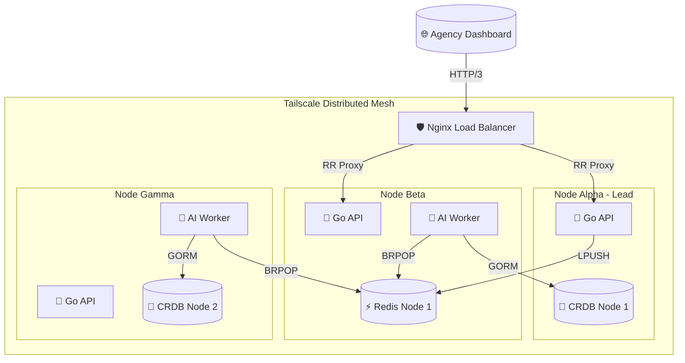

# Briefly Pentagram: A Deep-Dive into Distributed Mesh Architecture

The Briefly platform has evolved from a monolithic VM into a **Pentagram Cluster**—a decentralized, highly available 5-node distributed mesh. This architecture is designed for resilient, low-latency AI processing across a heterogeneous network of nodes.

---

## 1. The Network Fabric: Tailscale Mesh
At the foundation lies the **Tailscale overlay network**. This creates a flat, encrypted WireGuard-based mesh that abstracts away local network boundaries. Every node (Alpha through Epsilon) is assigned a stable, internal IP address, allowing for seamless inter-container communication regardless of the physical location of the hardware. This eliminates the need for complex VPNs or public port forwarding while maintaining zero-trust security.

## 2. Distributed Consensus & Persistence
### CockroachDB: The SQL Mesh
We utilize **CockroachDB** for distributed SQL persistence. Unlike traditional PostgreSQL, CockroachDB implements the **Raft consensus algorithm** at the range level. 
- **High Availability**: Data is automatically sharded and replicated across the 5 nodes. Even if two laptops go offline simultaneously, the cluster maintains serializable isolation and full availability.
- **Auto-Migration**: The Go backend utilizes GORM with a specific patch to handle CockroachDB's non-standard index creation, ensuring that schema updates are idempotent across all nodes during startup.

### Redis Cluster: High-Throughput KV & Messaging
For session management and task queuing, we deploy a **Redis Cluster**.
- **Sharding**: Key-space is partitioned into 16,384 hash slots distributed across the cluster nodes.
- **Queue Orchestration**: The `intake:queue` acts as the primary synchronization point between the Go API and Python Workers. We use the `BRPOP` (blocking right-pop) pattern to ensure exactly-once task delivery in a distributed environment, preventing race conditions where two workers might process the same intake.

## 3. Asynchronous Task Orchestration
The system decouples the **I/O-heavy API layer** from the **compute-heavy AI layer**.

### The Go API (Ingress Layer)
The backend is a stateless Go service designed for horizontal scalability. It handles multi-part form parsing (for audio/image uploads) and immediately offloads the processing to the Redis queue. 
- **The Nginx Gateway**: All incoming traffic (including public UI testing via **Tailscale Funnel**) is caught by a unified Nginx Reverse Proxy on Port 80, which securely routes `/api/` traffic to the Go backend and `/` traffic to the Vite frontend.
- **Real-time Updates**: Real-time updates are pushed back to the client via **Server-Sent Events (SSE)**, with the API layer acting as a PubSub consumer listening for completion events on Redis.

### The Python Worker (AI Execution Layer)
The AI pipeline, pinned to the stable `c7c545e` revision, utilizes **LangGraph** to execute a Directed Acyclic Graph (DAG) of processing nodes.
- **Fan-Out Parallelism**: The orchestrator can simultaneously trigger Whisper (audio transcription) and Vision-LLM (image OCR) nodes on different threads or even different physical nodes, significantly reducing total latency.
- **State Serialization**: The `IntakeState` object is passed through the graph, serving as a unified context that accumulates results before the final synthesis node generates the brief.

## 4. Operational Excellence & CI/CD
- **Nix Flakes**: The entire developer toolchain (Go 1.23, Python 3.11, Docker) is declaratively defined in `flake.nix`, ensuring "it works on my machine" is guaranteed for every team member.
- **Container Orchestration**: We use a specialized `docker-compose.distributed.yml` that leverages Docker's healthcheck system to resolve race conditions between service discovery and database readiness.
- **CI/CD Pipeline**: Our GitHub Actions pipeline validates both the Go compilation and Python linting before building and pushing OCI-compliant images to GHCR, ready for immediate pull-and-deploy on the mesh.

---

### The Pentagram Topology Summary

